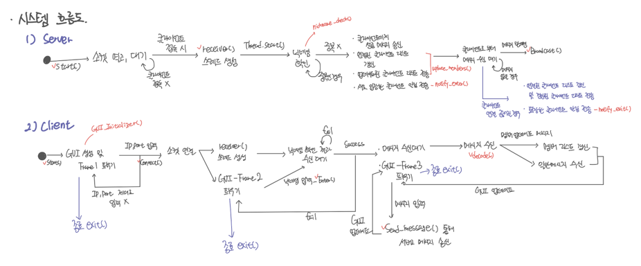

# Design process

## 사용자 요구사항
1. 여러 명의 사용자가 실시간으로 채팅하는 것이 가능하다.
    - 상대방이 보낸 메세지와 내가 보낸 메세지 모두 화면에 출력된다.
    - 현재는 내가 보낸 메시지와 상대방이 보낸 메세지가 각 오른쪽 왼쪽으로 구분되어 표시되지만 해당 기능까지는 구현하지 않는다.
2. 채팅을 누가 전송했는지 알 수 있다.
    - 특정 메세지를 누가 보냈는지 표시한다.
3. 채팅방에 입장하기 전에, 닉네임을 설정한다.
4. 현재 누가 나와 채팅중인지 목록 형태로 표시한다.
5. ‘전송’과 같은 특정 버튼을 통해 메세지를 전송할 수 있다.

## 시스템 요구사항
1. 클라이언트는 서버랑만 연결된다.
2. 클라이언트는 서버로만 메세지를 전송하고, 서버로부터만 메세지를 받아올 수 있다.
3. 서버는 스레드를 생성하여 클라이언트와 1:1로 연결된다.
    - N개의 클라이언트가 서버에 접속할 경우, 서버는 N개의 스레드가 생성된다.
4. 새로운 클라이언트가 접속하면 기존 클라이언트에게 알림이 간다.
5. 기존 클라이언트가 접속을 종료하면 다른 클라이언트에게 알림이 간다.
6. 닉네임을 입력한 사람만이 채팅을 할 수 있다.
7. 이미 사용중인 닉네임은 사용할 수 없다.

## 유스케이스 다이어그램 - 서버

## GUI 구성

## 클래스 추출

## 시스템 흐름도
