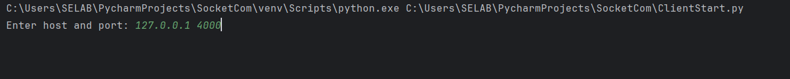

# 기본 실행 방법
1. 파이참 설치
2. ```git clone https://github.com/1876070677/SocketComm.git``` 이용해서 레포지토리 다운로드
3. 파이참에서 해당 프로젝트 열기
4. ServerStart, ClientStart 이용해서 실행

# ServerStart
ServerStart 파일을 클릭 후, 오른쪽 마우스 클릭.


Run 'ServerStart' 클릭

# ClientStart
다중 클라이언트이므로 여러 개의 클라이언트를 실행할 수 있도록 준비 필요


ClientStart 오른쪽 마우스 클릭, More Run/Debug > Modify Run Configuration.. 클릭


Modify options > Allow multiple instances 체크 > Apply > OK 클릭

ServerStart 실행하듯이 ClientStart 오른쪽 마우스 클릭 후 Run 'ClientStart' 클릭

두 개의 클라이언트를 실행하고 싶으면 Run 'ClientStart'를 두 번 실행하면 됨.

# Server 실행


Start server!!! 가 뜨면 제대로 실행된 것

# Client 실행


호스트와 포트를 입력하라고 뜨는데, 127.0.0.1 과 4000을 사진과 같이 입력.

로컬 환경에서 테스트이기 때문에 서버가 실행되고 있는 로컬 네트워크 주소와 해당 포트인 4000을 입력해줌.


서버와 연결이 완료되면 닉네임을 설정해야됨
원하는 닉네임을 입력. 만약 이미 서버에 연결 중인 클라이언트와 닉네임이 중복되는 경우, 닉네임 재입력을 요구할 수 있음

# 실행 결과


gildong-hong 연결 후, helloworld 연결이 이루어진 상태
```[리스트]``` 가 출력되고 있는데, 이것은 현재 서버에 연결된 클라이언트 목록을 보여줌


+ gildong-hong이 '안녕' 이라는 메시지를 입력한 상태,


+ helloworld가 '그래 안녕~' 이라는 메시지를 입력한 상태


+ helloworld의 소켓 연결이 끊어지는 경우, 퇴장 알림도 전송됨. 반대로 입장할 때는 이전 스크린샷에서도 볼 수 있듯이 입장 알림이 존재.


+ gildong-hong이 채팅 중인 상황에서 gildong-hong 닉네임으로 접속을 시도하는 경우, 닉네임 중복에 걸리는 모습. 중복되지 않은 닉네임을 입력할 때까지 반복됨.

# GUI 추가
1) 기본 화면
    


2) 닉네임 입력화면


3) 채팅 화면


+ 나와 상대방이 구분됨
+ 입장 및 퇴장 알림이 존재
+ 채팅을 하고 있는 상대들이 모두 보임

# 시연 영상
[](https://youtu.be/xdKqECPz6rM)